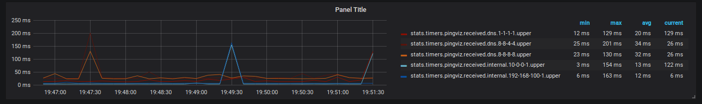
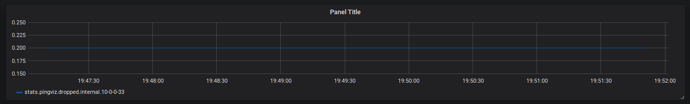

# PingViz

# Introduction

## What is it
PingViz an application to visualize small scale network latency on a home network.

After fighting with my cable company I wrote this to monitor the first 5 to 10 hops from my network out to theirs so I would have ammunition to get them to fix the issues that kept popping up.  

## Why use it
Its easy! A single binary and a config is all you need.
Knowledge is power!

No really, if you need it you already know it.

# Installation
Download the build artifact off of gitlab (http://gitlab.com/Khabi/pingviz/), create a config file and start it up.
**Better install directions along with service files coming soon!**


# Examples



Both examples above were generated from this config.
```yaml
log: debug
ttl: 1s
sleep: 5s 

report:
  host: log:8125
  prefix: pingviz.
  normalize: True
  normalize_char: "-"
  successful: received. 
  failed: dropped. 

hosts:
  internal:
    - "192.168.100.1"
    - "10.0.0.33"
    - "10.0.0.1"
  dns:
    - "8.8.8.8"
    - "8.8.4.4"
    - "1.1.1.1"
```

